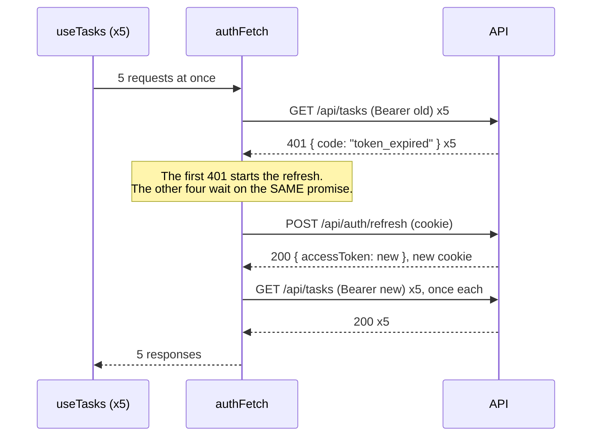

# Challenge 03 (hard): Token auth with silent refresh

## Scenario

TaskBoard is moving to token authentication. When you sign in, the API gives you two tokens:

- a short-lived **access token** (10 seconds in the dev server, so you can watch it expire). Every call to `/api/tasks` must carry it in an `Authorization: Bearer <token>` header;
- a long-lived **refresh token**, which the server keeps in a cookie. Swapping it at `/api/auth/refresh` gets you a new access token. Every refresh also **rotates** the refresh token: the old one stops working, and if anyone presents it again the server assumes it was stolen and ends the whole session.

The product owner's brief is one line: *"Users must never notice that tokens expire."* That means no surprise logouts, no failed screens, and no sign-in form every ten seconds. It also means no duplicate refreshes: two refreshes sent at the same time use the same refresh token twice, and the server treats that as theft.

The UI, the fake API and the tests are already written. Your job is the part in the middle: a `fetch` wrapper that handles tokens properly, and the wiring that connects it to React and TanStack Query.

## The refresh flow



If the refresh fails instead, there is no retry. `authFetch` clears the session and signals a logout, every waiting request rejects, and the UI goes back to the login page.

## Acceptance criteria

**`authFetch(url, init)`** in `src/auth/authFetch.ts`

- [ ] Adds `Authorization: Bearer <access token>` and keeps every header, method and body the caller passed.
- [ ] On a `401` whose JSON body is `{ code: "token_expired" }`, refreshes the access token and retries the original request **once** with the new token.
- [ ] If the retried request fails again, even with another `401`, that response goes back to the caller. No second refresh, no loop.
- [ ] Any other response (`200`, `400`, a `401` with a different code) goes straight back to the caller, with no refresh.
- [ ] If the refresh fails for any reason, it clears the session, emits **one** `"session_expired"` logout (see `authEvents.ts`) and rejects with `SessionExpiredError`. The refresh request itself is never retried.

**`refreshAccessToken()`**, which is single-flight

- [ ] While a refresh is in progress, every other caller gets the **same** promise. Five requests failing together cause exactly **one** `POST /api/auth/refresh`.
- [ ] Once that refresh settles, successful or not, the next call starts a new one.

**Token storage** in `src/auth/tokenStore.ts`

- [ ] The access token lives in memory only, never in `localStorage` or `sessionStorage`.
- [ ] Your code never handles the refresh token. It is a cookie (see [About the refresh cookie](#about-the-refresh-cookie)).
- [ ] `subscribe` and `getSession` work with `useSyncExternalStore`.

**Logging in and out** in `src/auth/session.ts` and `src/auth/crossTab.ts`

- [ ] `login` stores the session, and throws `LoginError("Wrong email or password")` on a `401`.
- [ ] `logout` calls `POST /api/auth/logout`, then clears the session, emits a `"user"` logout and broadcasts `{ type: "logout" }` on the `BroadcastChannel` named `taskboard-auth`. The last three steps run even if the request fails.
- [ ] When another tab broadcasts a logout, this tab clears its session and emits a `"remote"` logout. It does not call the server and does not broadcast again.

**React wiring** in `src/auth/AuthProvider.tsx` and `src/hooks/useTasks.ts`

- [ ] `AuthProvider` re-renders when the session changes, and shows the login page once it becomes `null`.
- [ ] On **every** logout (user, expired or remote), it calls `queryClient.clear()` and remembers the reason, so the login page can say *"Your session has expired"*.
- [ ] It closes the `BroadcastChannel` when it unmounts.
- [ ] `useTasks` loads `GET /api/tasks` through `authFetch`, not plain `fetch`.

**Checks**

- [ ] `npm test -- --run`, `npm run typecheck` and `npm run lint` all pass.

## How to run it

```bash
cd starter
npm install
npm test -- --run      # the tests: all 18 fail at first
npm run dev            # the app, with the fake API running in a service worker
```

Also useful: `npm run typecheck` and `npm run lint`. The tests describe the behaviour above. They fail now and should all pass when you finish. **Do not change the test files** (`*.test.ts`, `*.test.tsx` and `src/test/`).

In the browser, sign in as `demo@taskboard.dev` with password `password123`. The task list reloads every 3 seconds, so every 10 seconds you should see a refresh happen with no visible change. The dashed **Mock server** panel shows how many refreshes have happened. It also has buttons to expire the tokens, revoke the session and make the next refresh fail, so you can test each path by hand. To try cross-tab logout, open a second tab, sign in there too, then sign out in the first tab. (Each tab runs its own copy of the fake server, which is why you sign in twice.)

## The fake API

It is built with MSW (Mock Service Worker). The handlers are in `src/mocks/handlers.ts` and the server state is in `src/mocks/backend.ts`. The same handlers run in the browser and in the tests.

| Request | Success | Failure |
|---|---|---|
| `POST /api/auth/login` `{ email, password }` | `200 { accessToken, expiresIn, user }` and sets the refresh cookie | `401 { code: "invalid_credentials" }` |
| `POST /api/auth/refresh` (no body: it reads the cookie) | `200 { accessToken, expiresIn }` and rotates the cookie | `401` with `no_refresh_token`, `invalid_refresh_token`, `session_revoked` or `refresh_token_reused` |
| `POST /api/auth/logout` | `204` and revokes the session | |
| `GET /api/tasks` | `200 Task[]` | `401` with `missing_token`, `invalid_token` or **`token_expired`** |
| `POST /api/tasks` `{ title }` | `201 Task` | as above, plus `400 { code: "title_required" }` |

Build every URL from `API_URL` in `src/api/config.ts`, as the provided code already does.

## Which files are yours

| Provided: read, but you should not need to change | Yours: every one contains `TODO` |
|---|---|
| `src/mocks/*`: the fake API | `src/auth/tokenStore.ts` |
| `src/auth/authEvents.ts`: `onLogout` / `emitLogout` | `src/auth/authFetch.ts` |
| `src/auth/AuthContext.ts`: the context and `useAuth()` | `src/auth/session.ts` |
| `src/components/*`, `src/App.tsx`, `src/main.tsx` | `src/auth/crossTab.ts` |
| `src/types.ts`, `src/api/config.ts` | `src/auth/AuthProvider.tsx` |
| | `src/hooks/useTasks.ts` |

One rule: **nothing under `src/auth/` or `src/hooks/` may import from `src/mocks/`.** In a real app that code is on a server you cannot reach. The tests are allowed to import it, and so is the `DevTools` panel, which is only a teaching aid.

## About the refresh cookie

In production, the server sends the refresh token as a cookie like this:

```http
Set-Cookie: refresh_token=...; HttpOnly; Secure; SameSite=Strict; Path=/api/auth
```

`HttpOnly` means JavaScript **cannot read it**, so a cross-site scripting (XSS) bug cannot steal it. The browser attaches it automatically to requests under `/api/auth`, as long as you pass `credentials: "include"`, which you need for cross-origin APIs. `SameSite=Strict` stops other sites from making the browser send it.

MSW cannot set real HttpOnly cookies, so `src/mocks/backend.ts` keeps a pretend cookie jar that only the handlers touch. That is why `/api/auth/refresh` takes no body. Your code sends the request, and "the browser" (the mock) supplies the cookie. Still pass `credentials: "include"` on the auth calls: the mock ignores it, but a real server will need it.

The access token stays in a JavaScript variable. XSS could still use it while the page is open, but it cannot be copied out of storage and it expires within minutes. The cost is that a page reload forgets it; see the stretch goals.

## Revise these handbook sections

- **Day 2** (`Markdown Handbooks/Day02_Delegate_Handbook_Modern_JavaScript_and_Your_First_React_App.md`), Module 2.3: *Promises and async/await with fetch* and *Handling errors properly*, including why `fetch` does not reject on a `401`.
- **Day 5** (`Day05_Delegate_Handbook_Effects_Refs_and_Custom_Hooks.md`), Module 5.1: *Cleanup functions*. Module 5.4: *What is a custom Hook?*
- **Day 7** (`Day07_Delegate_Handbook_State_Management_and_Server_State.md`), Module 7.1: *Creating and providing context*. Module 7.4: *Providing the query client* and *Reading data with useQuery*.
- **Day 10** (`Day10_Delegate_Handbook_Performance_Testing_and_Deployment.md`), Module 10.2: *Mocking Server Actions and network calls*, for how MSW intercepts requests in the tests.

<details><summary><strong>Hint 1: where to start</strong></summary>

Go in the order the tests do. First `tokenStore.ts` (a variable, a `Set` of listeners and a `notify()` function), then an `authFetch` that only adds the header. That alone makes the first unit test pass. Run just the unit tests while you work: `npx vitest src/auth`.

</details>

<details><summary><strong>Hint 2: reading the 401 without breaking the response</strong></summary>

A response body can only be read once. If you call `res.json()` to check the error code and then return `res` to the caller, the caller's `res.json()` throws. Read a copy instead: `await res.clone().json()`. To merge headers, `new Headers(init.headers)` accepts every form a caller might pass (object, array or `Headers`). Then `.set("Authorization", ...)` on the copy.

</details>

<details><summary><strong>Hint 3: single flight</strong></summary>

Keep the *promise* in a module-level variable, not the token:

```ts
let refreshInFlight: Promise<string> | null = null;
```

If it is `null`, start the refresh and store the promise. If it is already set, return the stored one. Clear it when the promise **settles**, whether it succeeded or failed (`.finally`). Otherwise a failed refresh is remembered forever, or the next expiry reuses a stale token.

</details>

<details><summary><strong>Hint 4: logout once, not five times</strong></summary>

If five requests are waiting on one refresh and it fails, all five `catch` blocks run. Put `clearSession()` and `emitLogout("session_expired")` **inside** the shared refresh promise, so they run once however many callers are waiting. Also check that the refresh uses plain `fetch`. If it went through `authFetch`, a `401` from the refresh endpoint would try to refresh itself.

</details>

<details><summary><strong>Hint 5: the React side</strong></summary>

`useSyncExternalStore(subscribe, getSession)` gives you the session as React state. Put `onLogout(...)` and `startCrossTabSync(...)` in two `useEffect`s. Both return their own unsubscribe function, so you can return them directly as the cleanup. A `BroadcastChannel` never receives its own messages, so use a single channel per tab for both sending and receiving.

</details>

## Stretch goals

1. **Proactive refresh.** Use `expiresIn` to refresh about 5 seconds *before* the token expires, so users almost never hit a `401`. Keep the reactive path as a safety net, and cancel the timer on logout.
2. **Restore the session on reload.** On start-up, call `refreshAccessToken()` once. If it succeeds, you are still signed in (in production the cookie survives a reload). Show a splash screen while it runs, not the login page.
3. **Backoff for flaky networks.** A `500` or a network error during refresh does not prove the session is dead. Retry *those* (not `401`s) with exponential backoff, for example 250 ms, 500 ms and 1 s, before giving up.
4. **Refresh-token reuse UI.** When the refresh fails with `refresh_token_reused`, show *"For your security you have been signed out everywhere"* instead of the usual expiry message. `mockBackend.setRefreshCookie(oldValue)` lets you replay an old token to test it.
5. **Single flight across tabs.** Two tabs share one cookie, so if both refresh at the same moment the second one looks like reuse. Use the Web Locks API (`navigator.locks.request("refresh", ...)`) so only one tab refreshes at a time.
