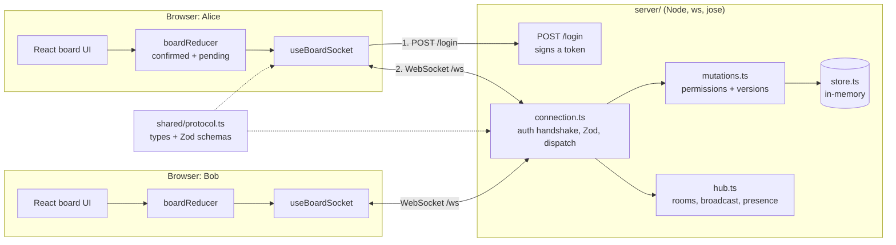
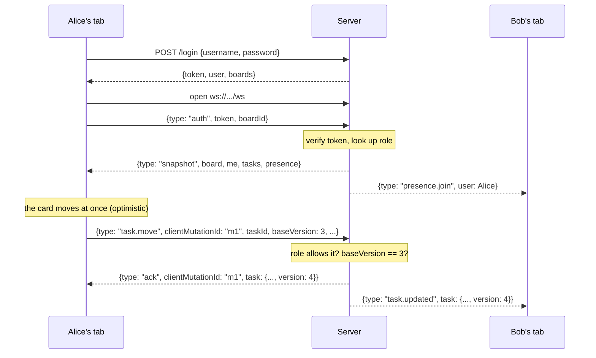

# Challenge 05 (very, very hard): Real-time collaborative TaskBoard

## Scenario

TaskBoard's customers want to plan together. When Alice drags a card to **Done**, Bob should see it move a moment later without refreshing. When both of them rename the same card at the same moment, one of them must win cleanly, and the other must see why their change did not stick. When a train goes into a tunnel, nothing typed on the laptop may be lost.

That rules out plain request and response. This version of TaskBoard has its own small Node server that keeps a **WebSocket** open to every browser. Every change travels over it and is pushed out to everyone else on the same board.

It also has to be secure. Anyone can open a WebSocket to a public server, and anyone can type messages into it by hand, so the server must work out who is on the other end, check what they are allowed to do **on every single message**, and never trust anything the browser claims about itself.

The board UI, the login page, the message types, an in-memory database and the HTTP login endpoint are already written. Your job is the real-time core: the authenticated socket, the rules the server enforces, the optimistic client state, and reconnecting.

This is the last and hardest challenge. It uses something from all ten days of the course. Expect it to take several sessions, and work through the milestones in order.

## Architecture

The project is an **npm workspaces** monorepo: one `npm install` at the root installs three packages.



| Folder | What is in it |
|---|---|
| `shared/` | `src/protocol.ts`: every message type, the Zod schemas for client messages, and the close codes. Both sides import it as `@taskboard/shared`. |
| `server/` | A plain `node:http` server with `POST /login` and a `ws` WebSocket server on `/ws`. TypeScript, run with `tsx`. No framework. |
| `client/` | Vite, React 19 and TypeScript. |

### The life of a change



If the server says no, Alice's tab gets `{type: "error", clientMutationId: "m1", ...}` instead of the ack, and her card jumps back.

## The protocol

All of it is in `shared/src/protocol.ts`. Read that file first: it is short and fully commented.

**Client to server.** The server validates every one of these with Zod before it looks at it.

| `type` | Fields | Who may send it |
|---|---|---|
| `auth` | `token`, `boardId` | Anyone, and it **must** be the first message |
| `task.create` | `clientMutationId`, `task: {id, title, description, column, order}` | owner, member |
| `task.update` | `clientMutationId`, `taskId`, `baseVersion`, `changes: {title?, description?}` | owner, member |
| `task.move` | `clientMutationId`, `taskId`, `baseVersion`, `column`, `order` | owner, member |
| `task.delete` | `clientMutationId`, `taskId`, `baseVersion` | owner (any task), member (own tasks only) |

**Server to client.**

| `type` | Fields | Sent to | When |
|---|---|---|---|
| `snapshot` | `board`, `me`, `tasks`, `presence` | the new socket | straight after a good `auth`, and again after every reconnect |
| `ack` | `clientMutationId`, `taskId`, `task` (`null` after a delete) | the sender | a mutation was accepted |
| `error` | `code`, `message`, `clientMutationId?`, `current?` | the sender | a message was rejected. `current` is the server's copy on `CONFLICT`, `null` on `NOT_FOUND` |
| `task.created` | `task`, `by` | everyone **else** on the board | after an accepted `task.create` |
| `task.updated` | `task`, `by` | everyone else | after an accepted `task.update` **or** `task.move` |
| `task.deleted` | `taskId`, `by` | everyone else | after an accepted `task.delete` |
| `presence.join` | `user` | everyone else | a user's **first** tab joins the board |
| `presence.leave` | `userId` | everyone else | a user's **last** tab leaves the board |

**Close codes.** When the server closes a socket on purpose, it uses a code the client can act on:

| Code | Constant | Meaning | What the client does |
|---|---|---|---|
| `4001` | `CLOSE_UNAUTHENTICATED` | No `auth`, a bad token, or the token expired | Back to the login page. **Do not** reconnect. |
| `4003` | `CLOSE_FORBIDDEN` | Valid token, but no role on this board | Show "no access". **Do not** reconnect. |
| anything else | | The network dropped, the server restarted | Reconnect with backoff |

**Who may do what.** The one rule table, enforced by `can()` in `server/src/permissions.ts`:

| Role | create | update | move | delete |
|---|---|---|---|---|
| owner | yes | yes | yes | any task |
| member | yes | yes | yes | only tasks they created |
| viewer | no | no | no | no |

### Why the token goes in a message, not the URL

The easy way to authenticate a WebSocket is `new WebSocket("wss://api.example.com/ws?token=eyJ...")`. **Do not do this.** URLs are written down all over the place: in the server's and the proxy's access logs, in load balancer logs, in monitoring tools, in browser history, and sometimes in `Referer` headers. A token in a query string ends up in all of them, and anyone who can read a log can then be your user until the token expires.

The browser's `WebSocket` cannot send custom headers such as `Authorization`, so the two safe choices are:

1. **A first message** `{type: "auth", token}` straight after the socket opens. Message bodies are not logged by proxies. This is what you will build.
2. **A subprotocol**: `new WebSocket(url, ["taskboard", token])` puts the token in the `Sec-WebSocket-Protocol` header. Headers are logged less often than URLs, but some proxies still do, and the value must be echoed back by the server.

With the first-message approach, the server has to treat a socket as **anonymous** until that message arrives and checks out, and close it if it never does.

## Which files are yours

Every file in the right-hand column contains `TODO` comments that tell you what it must do.

| Provided: read, but you should not need to change | Yours |
|---|---|
| `shared/src/protocol.ts`: messages, schemas, close codes | `server/src/auth.ts`: `verifyToken` (`signToken` is done, as an example) |
| `server/src/store.ts`: the in-memory database and seed data | `server/src/permissions.ts`: `can()` |
| `server/src/hub.ts`: rooms, `broadcast`, `presence`, `send` | `server/src/mutations.ts`: `applyMutation()` |
| `server/src/http.ts`: `POST /login`, `GET /health`, CORS | `server/src/connection.ts`: `handleConnection()` |
| `server/src/app.ts`, `config.ts`, `index.ts`: start-up, Origin check, heartbeat | `client/src/board/boardReducer.ts`: the reducer and `selectTasks` |
| `client/src/components/*`: login page, board, columns, cards, presence bar | `client/src/board/useBoardSocket.ts`: the socket Hook |
| `client/src/auth/session.ts`, `App.tsx`, `config.ts`, `board/ordering.ts` | `client/src/board/backoff.ts`: `backoffDelay()` |

**Do not change the test files** (`*.test.ts`). If a test looks wrong, read this brief again first.

## Milestones

Go in this order. Each one builds on the one before, and each ends with something you can see working.

1. **The authenticated socket.** Write `verifyToken` in `auth.ts`, then the handshake half of `handleConnection`: an auth timeout, "the first message must be a valid `auth`", `4001` and `4003`. On the client, open the socket in a `useEffect` and send `auth` on open.
   *Done when* `npx vitest run server/src/auth.test.ts` passes and the "authentication handshake" tests in `integration.test.ts` pass, apart from the two that need a snapshot (milestone 2).
2. **Snapshot and broadcast.** After a good `auth`, join the hub and send a `snapshot`. In the reducer, handle `snapshot`, `task.created`, `task.updated` and `task.deleted`. Dispatch every server message from the Hook.
   *Done when* the board loads in the browser, and a change made by `curl` or a second tab shows up (you will need milestone 3's server half for the second tab).
3. **Optimistic updates and acks.** Write `can()` and the happy path of `applyMutation`. Send the ack to the sender and the broadcast to everyone else. On the client, `mutate` adds a pending mutation, `selectTasks` replays pending on top of confirmed, an `ack` clears it, and an `error` rolls it back.
   *Done when* `permissions.test.ts` passes, and a viewer (`carol`) who forces a change through (see `CHECKLIST.md`) sees it snap back with a message.
4. **Versions and conflicts.** Check `baseVersion` against the stored version, reply `CONFLICT` with `current`, and have the reducer take the server's copy.
   *Done when* `mutations.test.ts` passes, except the replay test, which is milestone 6.
5. **Presence.** Broadcast `presence.join` for a user's first tab and `presence.leave` for their last. Handle both in the reducer.
   *Done when* the avatars in two windows update as you open and close tabs.
6. **Reconnect and the offline queue.** `backoffDelay`, reconnecting on close (but not on `4001` or `4003`), an outbox of unacknowledged mutations replayed after each snapshot, and the server treating a repeated `clientMutationId` as already done.
   *Done when* `backoff.test.ts` and the replay test pass, and the offline checks in `CHECKLIST.md` work.
7. **Tests and deployment.** Make every test pass, run `CHECKLIST.md` in two browsers, then deploy it (see [Deploying](#deploying)).

## Acceptance criteria

**The authenticated socket** (server)

- [ ] `verifyToken` returns the claims for a good token, and `null` (never an exception) for a bad signature, an expired token, a tampered payload, the wrong audience or garbage. It pins the algorithm to `HS256`.
- [ ] The token is sent in the first message, never in the URL.
- [ ] A socket whose first message is not a valid `auth` is closed with `4001`. So is one with a bad or expired token, and one that sends nothing within `authTimeoutMs`.
- [ ] A valid token for a user with no role on the board is closed with `4003`.
- [ ] An authenticated socket is closed with `4001` when its token expires, even if it goes quiet.
- [ ] Every message is parsed with `parseClientMessage` (Zod). An invalid message from an authenticated socket gets an `INVALID` error and the socket stays open.

**Permissions and versions** (server)

- [ ] `can()` implements the rule table above and denies anyone with no role.
- [ ] The role is looked up from the store **on every message**, so a demoted user is stopped at their next message, not their next login.
- [ ] The board a change applies to comes from the verified session, never from the message. A task id from another board is `NOT_FOUND`.
- [ ] Every task has a `version`, starting at `1` and going up by one on every accepted change. A mutation whose `baseVersion` does not match is rejected with `CONFLICT` and the current task.
- [ ] Each rejection carries the `clientMutationId` it rejects.
- [ ] The sender gets an `ack`; everyone else on the board gets the broadcast; nobody else hears about a rejected change.
- [ ] Sending the same `clientMutationId` twice applies the change once, and the second time returns the original ack with no broadcast.

**Optimistic UI** (client)

- [ ] Creating, renaming, moving and deleting a task shows on screen at once, before the server answers, with a "Saving…" hint on the card.
- [ ] An ack clears the pending change; a rejection rolls it back and shows the server's message.
- [ ] On `CONFLICT`, the card shows the server's version. On `NOT_FOUND`, it disappears.
- [ ] A broadcast older than the copy you already hold is ignored.
- [ ] Changes from other users appear without a refresh, and do not wipe out your own pending changes.

**Presence** (both)

- [ ] The presence bar shows one avatar per connected user, with their role, and updates when people join and leave.
- [ ] A user with two tabs open appears once, and only leaves when their last tab closes.
- [ ] Closing a tab removes its avatar from everyone else's screen within a second or two.

**Reconnecting** (client)

- [ ] When the connection drops (other than `4001` or `4003`), the banner says so and the client reconnects with exponential backoff and jitter, capped at 30 seconds.
- [ ] After reconnecting, the board is rebuilt from the new snapshot, so changes made by others meanwhile appear and deleted tasks disappear.
- [ ] Changes made while offline are shown, queued, and sent after the snapshot, in order. None is applied twice.
- [ ] A `4001` close sends the user back to the login page with *"Your session has expired"*.

**Checks**

- [ ] `npm test -- --run`, `npm run typecheck`, `npm run lint` and `npm run build` all pass.
- [ ] Every item in `CHECKLIST.md` is ticked.

## How to run it

You need Node.js 22.9 or later (the server's dev script uses `--env-file-if-exists`).

```bash
cd starter
npm install            # once, at the root: installs shared/, server/ and client/
npm test -- --run      # every workspace's tests: nearly all fail at first
npm run dev            # the server on :8787 and the client on :5173, side by side
```

Open http://localhost:5173 and log in. There are three demo users, all with the password `password123`:

| User | Product launch board | Ops rota board |
|---|---|---|
| `alice` | owner | viewer |
| `bob` | member | owner |
| `carol` | viewer | (no access) |

To be two people at once, use **two different browsers**, or one normal window and one private window. (The login is kept in `sessionStorage`, so separate tabs in one window can also be separate users, but *Duplicate tab* copies the login.) The data lives in memory, so restarting the server resets it.

Also useful:

```bash
npm run typecheck                       # tsc in every workspace
npm run lint                            # ESLint across the repo
npm run build                           # production build of the client
npx vitest run server                   # just the server tests
npx vitest run client                   # just the client tests
npx vitest run server/src/integration   # just the two-client integration test
```

The integration test starts the real server on a random port and connects two real `ws` clients to it, the same way two browsers would.

## Deploying

The server holds open connections and state in memory, so it needs a host that runs a **long-lived Node process**. Serverless functions (Vercel Functions, Netlify Functions, AWS Lambda) are the wrong shape for it: they are frozen between requests. The client is static files, which suit Vercel.

**Server on Fly.io, Render or Railway.** Point the service at the repo, with `server/` as the start command's workspace:

- Build command: `npm ci`
- Start command: `npm run start -w server`
- Health check path: `/health`
- Run **exactly one instance**. The store and the hub are in memory, so two instances would be two separate boards that cannot see each other. (Scaling out needs a shared database plus a pub/sub channel such as Redis between instances; see the stretch goals.)
- On Render, pick a *Web Service*, not a *Background Worker*, so it gets a public URL. On Fly, `fly launch` then `fly scale count 1`.

**Client on Vercel.** Import the repo, set the **Root Directory** to `client`, framework preset **Vite**. Vercel installs from the workspace root, so `@taskboard/shared` resolves.

**Environment variables**

| Where | Variable | Example | Notes |
|---|---|---|---|
| server | `JWT_SECRET` | 32+ random characters | **Required** in production. The server refuses to start with `NODE_ENV=production` and the dev secret. Generate one with `node -e "console.log(require('node:crypto').randomBytes(32).toString('base64url'))"`. Keep it in the host's secret store, never in the repo. |
| server | `ALLOWED_ORIGINS` | `https://taskboard.vercel.app` | Comma-separated. Used for CORS on `/login` **and** to refuse WebSocket upgrades from other sites. |
| server | `TOKEN_TTL` | `1h` | How long a token lasts. |
| server | `PORT` | `8787` | Most hosts set this for you. |
| server | `NODE_ENV` | `production` | |
| client | `VITE_SERVER_URL` | `https://taskboard-api.fly.dev` | Read at **build** time. The client derives `wss://.../ws` from it. |

Use `https://` for the server so the socket is `wss://` (TLS). A page served over HTTPS is not allowed to open a plain `ws://` socket anyway. For local development, copy `.env.example` to `server/.env`; the dev script loads it if it exists.

## Revise these handbook sections

- **Day 2** (`Markdown Handbooks/Day02_Delegate_Handbook_Modern_JavaScript_and_Your_First_React_App.md`), Module 2.3: *Promises and async/await with fetch*. The handshake is asynchronous; think about what happens to messages that arrive while it runs.
- **Day 5** (`Day05_Delegate_Handbook_Effects_Refs_and_Custom_Hooks.md`), Module 5.1: *The dependency array controls when effects run* and *Cleanup functions*. Module 5.3: *Ref or state?* Module 5.4: *What is a custom Hook?*
- **Day 6** (`Day06_Delegate_Handbook_TypeScript_and_Routing.md`), Module 6.1: *Object types, unions and optional fields*, for the discriminated unions in `protocol.ts`.
- **Day 7** (`Day07_Delegate_Handbook_State_Management_and_Server_State.md`), Module 7.2: *A reducer function* and *Using useReducer*.
- **Day 8** (`Day08_Delegate_Handbook_Styling_Forms_and_React_19_Features.md`), Module 8.3: *Describing data with a Zod schema*. Module 8.4: *useFormStatus and useOptimistic* (and see Hint 4 for why this challenge uses a reducer instead).
- **Day 9** (`Day09_Delegate_Handbook_Full_Stack_React_with_Next_js.md`), Module 9.3: *Server Actions are public endpoints*. A WebSocket message is the same: anyone can send anything.
- **Day 10** (`Day10_Delegate_Handbook_Performance_Testing_and_Deployment.md`), Module 10.2: *Unit testing pure logic* and *End-to-end testing with Playwright*. Module 10.3: *Deploying to Vercel* and *Running in production*.

<details><summary><strong>Hint 1: the handshake, and messages that arrive too early</strong></summary>

Keep a `let session: Session | null = null` inside `handleConnection`. While it is `null`, the only thing you accept is a valid `auth`.

`verifyToken` is `async`. A client can send `auth` and then a `task.create` in the same millisecond, and the `task.create` handler will run while `verifyToken` is still waiting, with `session` still `null`. The simple fix is to handle messages one at a time with a promise chain:

```ts
let queue = Promise.resolve()
socket.on('message', (raw) => {
  queue = queue.then(() => handleRaw(raw)).catch(reportError)
})
```

</details>

<details><summary><strong>Hint 2: the order of the checks in applyMutation</strong></summary>

1. Look up the role **now**, from the store: `store.getRole(actor.boardId, actor.userId)`. Never cache it on the socket.
2. Find the task. If it does not exist **or** `task.boardId !== actor.boardId`, it is `NOT_FOUND` with `current: null`. Saying `FORBIDDEN` would confirm to a stranger that the id exists.
3. `can(role, msg.type, actor.userId, task)`.
4. `task.version !== msg.baseVersion`? `CONFLICT`, with `current: task`.
5. Only now change anything: spread the changes, `version: task.version + 1`, `putTask`.

Permission before version: a viewer should hear "not allowed", not "someone else changed this".

</details>

<details><summary><strong>Hint 3: optimistic state without "undo"</strong></summary>

Do not change `confirmed` when the user acts. Keep two things: `confirmed` (only ever written from server messages) and `pending` (a list of mutations waiting for an answer). What the user sees is computed:

```ts
export function selectTasks(state: BoardState): Task[] {
  const tasks = { ...state.confirmed }
  for (const m of state.pending) applyOptimistic(tasks, m)
  return Object.values(tasks).sort((a, b) => a.order - b.order)
}
```

Now rollback is just "remove it from `pending`". There is nothing to undo, and a rollback cannot accidentally undo someone else's change that arrived in between.

Bump the version in `applyOptimistic` too. If a user renames a card and then moves it before the first ack arrives, the move must carry the version the server **will** have after the rename, or the server rejects it as a conflict.

</details>

<details><summary><strong>Hint 4: why not useOptimistic?</strong></summary>

`useOptimistic` shows an optimistic value only while an **action** (a transition) is pending, and drops it when the action finishes. Here there is no promise per change to wait on: the answer arrives later, as a separate message on the socket, possibly after a reconnect. You need optimistic state that survives across renders, reconnects and resyncs, and the reducer above does exactly that. Try `useOptimistic` as a stretch goal if you want to see the difference.

</details>

<details><summary><strong>Hint 5: the socket Hook</strong></summary>

- Everything about one connection lives inside one `useEffect(() => { ... }, [token, boardId])`: `connect()`, the retry timer, a `stopped` flag, and a cleanup that sets `stopped`, clears the timer and closes the socket. In development, StrictMode mounts, unmounts and remounts, so your cleanup **will** run straight away. Check that you end up with one socket, not two.
- Things that must survive a reconnect but must not cause a render go in refs: the current socket, "have I had a snapshot yet?", and the outbox.
- `onUnauthorised` is a callback prop. Putting it in the effect's dependency array would reconnect on every render. React 19.2's `useEffectEvent` gives you a stable function that always calls the latest callback.
- `onclose` receives a `CloseEvent`. Read `event.code` to decide between "log out", "no access" and "try again".

</details>

<details><summary><strong>Hint 6: replaying the outbox safely</strong></summary>

When the connection drops, you cannot know whether your last message reached the server. Maybe it did, and only the ack was lost. If you replay it and the server applies it again, a rename is harmless but a create makes a duplicate, and an update is rejected as a conflict with itself.

The fix is **idempotency**: the server remembers each accepted `clientMutationId` (per user) and, when it sees one again, sends back the same ack without changing anything. `store.rememberProcessed` and `store.getProcessed` are there for this. On the client, remove a mutation from the outbox only when its `ack` or `error` arrives, and send the whole outbox after every `snapshot`.

</details>

<details><summary><strong>Hint 7: backoff with jitter</strong></summary>

`ceiling = min(maxMs, baseMs * 2 ** attempt)`, then pick a random point in the upper half: `ceiling / 2 + random() * ceiling / 2`. The jitter matters when the server restarts: without it, every client that was connected retries at exactly the same moments and knocks it over again. Reset `attempt` to `0` when a snapshot arrives, not when the socket opens: a socket that opens and is closed straight away has not really reconnected.

</details>

## Stretch goals

1. **Field-level merge.** Today, any concurrent change to a task is a conflict. If Alice renames a card while Bob moves it, those do not really clash. Have `task.update` and `task.move` send the fields they change plus the `baseVersion`, and keep enough history on the server (the task at each version, or the version at which each field last changed) to accept the change when none of *its* fields changed since `baseVersion`. Reject only true clashes.
2. **Playwright with two browser contexts.** `e2e/two-users.spec.ts` and `playwright.config.ts` are included but not part of `npm test`. Run `npx playwright install chromium`, then `npm run test:e2e`. Playwright starts both servers for you. Add a test for the offline queue: `page.routeWebSocket()` lets a test close the socket or hold messages back.
3. **Refresh the token over the socket.** Tokens last an hour, and the socket is closed when the token expires. Let the client send a fresh `auth` message before that happens, and have the server swap the session's expiry without reconnecting.
4. **Proper drag and drop.** Replace the arrow buttons with drag and drop (native HTML drag events, or dnd-kit) and fractional ordering: a card dropped between orders `2` and `3` gets `2.5`, so moving one card never rewrites its neighbours.
5. **"Bob is editing…"** Send an ephemeral `presence.editing {taskId}` message when someone opens a card's editor, and show it on everyone else's copy of that card. It is never stored.
6. **Persistence.** Replace the in-memory store with SQLite or Postgres. The `Store` class is the only thing that should change. Store password hashes (argon2 or bcrypt), not passwords.
7. **More than one server.** Put a Redis pub/sub channel between instances, so a change on instance A is broadcast to sockets on instance B, and run two instances behind a load balancer.
8. **Rate limiting.** Allow each socket, say, 20 messages a second, and close it with `1008` (policy violation) if it sends more.
